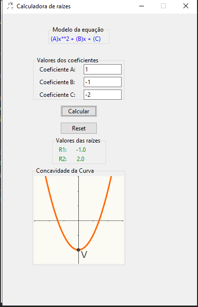

# Calculadora-2-grau-python-tkinter-
Uma calculadora que possibilita encontrar as raízes de uma função quadrática e apresentar a possível concavidade da curva do gráfico.

Previews da GUI 

#### Estado vazio

#### Concavidade para cima

#### Concavidade para baixo
